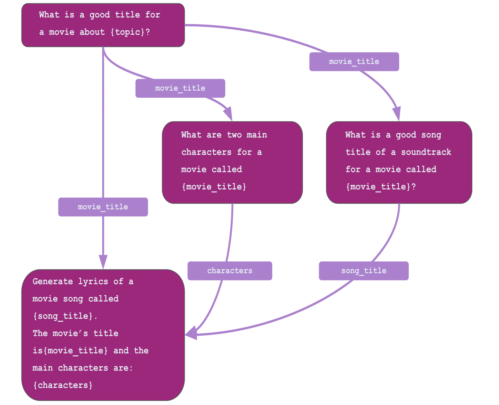

## TL;DR

```python
from llmflows.flows import Flow, FlowStep
from llmflows.llms import OpenAI
from llmflows.prompts import PromptTemplate


openai_llm = OpenAI(api_key="<your-api-key>")

# Create prompt templates
title_template = PromptTemplate("What is a good title of a movie about {topic}?")
song_template = PromptTemplate(
    "What is a good song title of a soundtrack for a movie called {movie_title}?"
)
characters_template = PromptTemplate(
    "What are two main characters for a movie called {movie_title}?"
)
lyrics_template = PromptTemplate(
    "Write lyrics of a movie song called {song_title}. The main characters are"
    " {main_characters}"
)

# Create flowsteps
flowstep1 = FlowStep(
    name="Movie Title Flowstep",
    llm=openai_llm,
    prompt_template=title_template,
    output_key="movie_title",
)

flowstep2 = FlowStep(
    name="Song Title Flowstep",
    llm=openai_llm,
    prompt_template=song_template,
    output_key="song_title",
)

flowstep3 = FlowStep(
    name="Characters Flowstep",
    llm=openai_llm,
    prompt_template=characters_template,
    output_key="main_characters",
)

flowstep4 = FlowStep(
    name="Lyrics Flowstep",
    llm=openai_llm,
    prompt_template=lyrics_template,
    output_key="song_lyrics",
)

# Connect flowsteps
flowstep1.connect(flowstep2, flowstep3, flowstep4)
flowstep2.connect(flowstep4)
flowstep3.connect(flowstep4)

# Create and start the Flow
soundtrack_flow = Flow(flowstep1)
results = soundtrack_flow.start(topic="friendship", verbose=True)
print(results)

```
***
## Guide
In the Introduction section we covered the `Flow` and `FlowStep` abstractions and we saw 
how we can create explicit, and transparent LLM Flows to build LLM-powered apps. In 
this guide we will dive a bit deeper and will build a slightly more complex example.

Let's imagine that for some reason you want to create an app that can generate a movie 
title, a movie song title based on the movie title, write a summary for the two main 
characters of the movie and finally create song lyrics based on movie title, song 
title, and the two characters.

Here is a visual representation of a flow that can help us do that:



Let's start by defining the prompt templates:

```python
from llmflows.prompts import PromptTemplate

title_template = PromptTemplate("What is a good title of a movie about {topic}?")
song_template = PromptTemplate(
    "What is a good song title of a soundtrack for a movie called {movie_title}?"
)
characters_template = PromptTemplate(
    "What are two main characters for a movie called {movie_title}?"
)
lyrics_template = PromptTemplate(
    "Write lyrics of a movie song called {song_title}. The main characters are"
    " {main_characters}"
)
```

Now we can create the four flowsteps:
```python
from llmflows.flows import Flow, FlowStep
from llmflows.llms import OpenAI

openai_llm = OpenAI(api_key="<your-api-key>")

# Create flowsteps
flowstep1 = FlowStep(
    name="Movie Title Flowstep",
    llm=openai_llm,
    prompt_template=title_template,
    output_key="movie_title",
)

flowstep2 = FlowStep(
    name="Song Title Flowstep",
    llm=openai_llm,
    prompt_template=song_template,
    output_key="song_title",
)

flowstep3 = FlowStep(
    name="Characters Flowstep",
    llm=openai_llm,
    prompt_template=characters_template,
    output_key="main_characters",
)

flowstep4 = FlowStep(
    name="Lyrics Flowstep",
    llm=openai_llm,
    prompt_template=lyrics_template,
    output_key="song_lyrics",
)

```

Once we have defined the flowsteps we can connect them to create the flow from the 
figure above:
```python
flowstep1.connect(flowstep2, flowstep3, flowstep4)
flowstep2.connect(flowstep4)
flowstep3.connect(flowstep4)
```

Finally, we can create the Flow object and start the flow:

```python
soundtrack_flow = Flow(flowstep1)
results = soundtrack_flow.start(topic="friendship", verbose=True)
```

And Voilà! We managed to create a complex flow pretty much as easy as the basic example 
from the previous guide. 
LLMFlows will figure out the dependencies, and run the flowsteps in the right order - 
making sure that all the inputs are available before running a given flowstep. 

In fact, you might have already noticed that there is an emerging pattern:

1. Decide how the flow should look like
2. Create the prompt templates
3. Create flowsteps
4. Connect flowsteps
5. Start the flow

By following this pattern you can create any flow with any level of complexity as long 
as you can represent it as a DAG.

In our next guide we will create a flow that can be optimized for total runtime by 
running flowsteps that already have all their required inputs in parallel.

***
[:material-arrow-left: Previous: Introduction](Introduction.md){ .md-button }
[Next: Async Flows :material-arrow-right:](Async Flows.md){ .md-button }
